# Velocity Cycles Business Intelligence

An end-to-end business intelligence project that transforms internet-sales warehouse data into an SSAS multidimensional cube and a decision-focused Power BI dashboard. The analysis applies CRISP-DM to answer where revenue is concentrated, which products generate the most profit, and which customer segments drive sales.

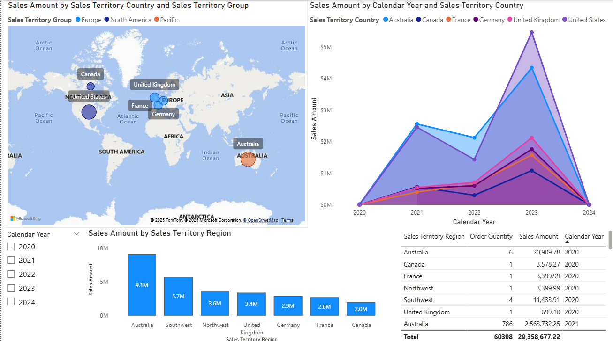

## Business questions

- Which regions and countries contribute the most sales?
- Which product categories and subcategories generate the most profit?
- How do sales and profit change over time?
- Which age, marital-status, and gender segments are commercially important?
- Who are the highest-value customers?

## Key findings

| Finding | Business implication |
|---|---|
| Australia and the Southwest USA together generated more than 50% of total revenue. | Protect the strongest markets while investigating growth opportunities in lower-penetration regions. |
| Road Bikes produced **$5.54M** profit and Mountain Bikes produced **$4.51M**. | Prioritize inventory, promotions, and product planning around the strongest bike subcategories. |
| Customers aged **46–60** generated the highest sales across both married and single segments. | Treat this group as a core target for retention and tailored campaigns. |
| Female customers led total sales and profit in the project analysis. | Use gender-level analysis to refine targeting while validating differences at product and transaction level. |

## Solution architecture

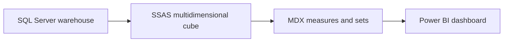

The cube is built around the `Fact Internet Sales` measure group and reusable dimensions for product, customer, sales territory, geography, date, product subcategory, and product category.

Custom MDX adds analytical features that are not directly stored in the warehouse:

- `Profit = Sales Amount - Total Product Cost`
- Customer age bands, including the 46–60 segment
- Top-gender sales calculation
- A named set for the top 10 customers by sales

## Dashboard evidence

### Regional performance dashboard

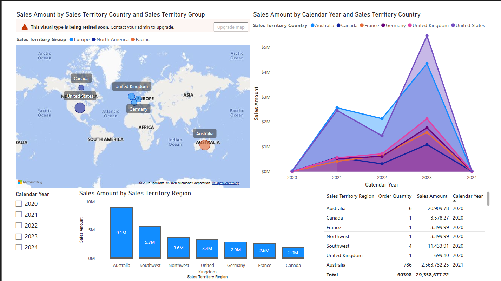

### Product profitability dashboard

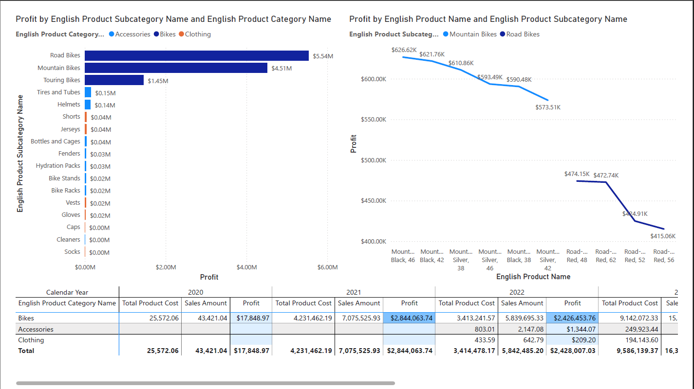

### Customer segmentation dashboard

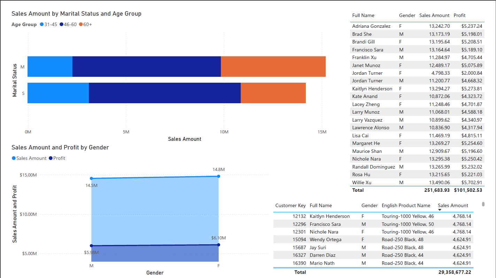

### Regional performance

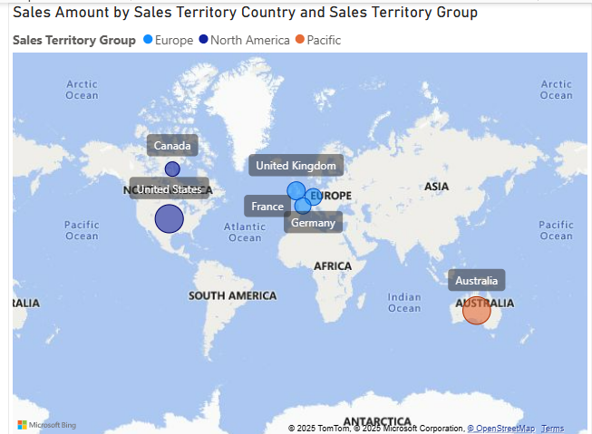

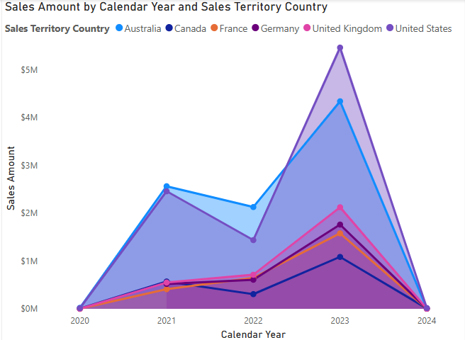

### Product profitability and customer segmentation

| Product profitability | Sales by age and marital status |
|---|---|
| 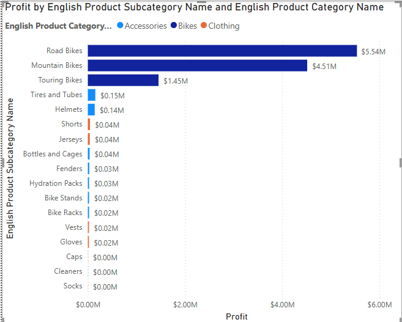 | 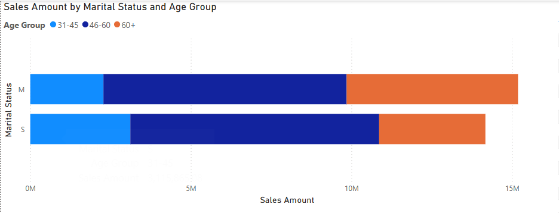 |

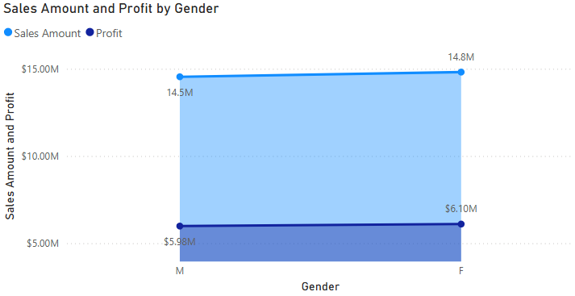

### SSAS data source view

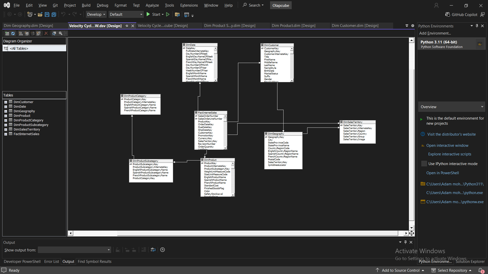

## Repository guide

| Path | Contents |
|---|---|
| `power-bi/` | Interactive Power BI report (`.pbix`) |
| `ssas/Olapcube/` | SSAS cube, dimensions, data source view, partitions, and project files |
| `docs/Velocity-Cycles-BI-Report.docx` | Full methodology, analysis, findings, and recommendations |
| `docs/screenshots/` | Selected dashboard and cube-design evidence |

## How to explore the project

### Power BI

1. Download `power-bi/Velocity-Cycles-Sales-Analytics.pbix`.
2. Open it in Power BI Desktop.
3. Use the report filters and drill-down interactions to explore regional, product, time, and customer performance.

The packaged report can be reviewed without recreating the warehouse. Refreshing the data requires a compatible SQL Server/SSAS environment.

### SSAS cube

1. Install the Microsoft Analysis Services Projects extension for Visual Studio.
2. Open `ssas/Olapcube/Olapcube.dwproj`.
3. Follow the [SSAS setup notes](ssas/README.md) to configure the placeholder SQL Server connection.
4. Deploy and process the cube, then connect Power BI to the deployed model if you want to reproduce the full pipeline.

## Tools and skills demonstrated

`Power BI` · `SQL Server` · `SSAS Multidimensional` · `MDX` · `Data Warehousing` · `Dimensional Modeling` · `Dashboard Design` · `Business Analysis` · `CRISP-DM`

## Notes and limitations

- Findings are based on the Velocity Cycles/AdventureWorks-style educational dataset and should be treated as portfolio analysis, not live company performance.
- The original database backup is omitted because it exceeds GitHub's 100 MB standard file limit.
- Local server names and Visual Studio user settings were removed before publication.
- The full written methodology and supporting interpretation are available in the [project report](docs/Velocity-Cycles-BI-Report.docx).

## Author

**Adam Mohamed Eldaleel** 
Junior Data Analyst · Power BI · SQL · Python · R

- [GitHub](https://github.com/Eldaleel)
- [Portfolio](https://adam-eldaleel-portfolio.adameldaleel.chatgpt.site)
